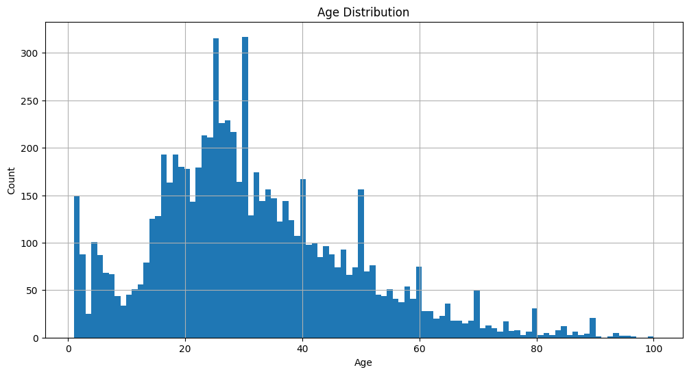
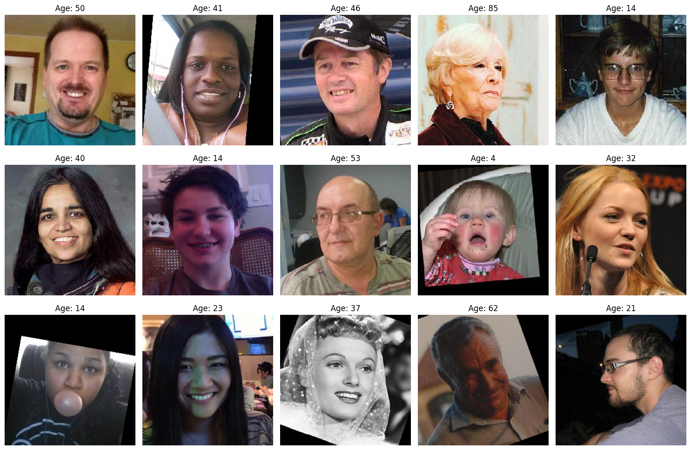

# Customer Age Estimation with Computer Vision



This project evaluates whether a transfer-learning computer vision model can estimate customer age accurately enough to support age-restricted retail workflows.

## Results At A Glance

### Performance Summary

- Best validation MAE: ~6.64
- Final validation MAE: ~7.65
- Target threshold: MAE < 8.0
- Status: requirement met



This model is positioned as a decision-support tool: it helps flag potentially underage customers for manual ID verification.

## Project Snapshot

| Metric | Result |
|---|---:|
| Dataset size | 7,591 face images |
| Model backbone | ResNet50 (ImageNet pretrained) |
| Target metric | MAE < 8.0 |
| Best validation MAE | ~6.64 |
| Final validation MAE | ~7.65 |
| Outcome | Target met |

## Visuals

- Age distribution: 
- Sample training images: 

## Highlights

- Built with TensorFlow/Keras and a pretrained ResNet50 backbone.
- Performed EDA on 7,591 labeled face images.
- Achieved validation MAE below the required threshold of 8 years.
- Includes both a polished notebook and a standalone training script.

## Repository Structure

- `age_estimation_analysis.ipynb`: Recruiter-ready analysis notebook.
- `age_estimation_analysis_original.ipynb`: Original unedited notebook snapshot.
- `src/train_age_model.py`: Standalone training pipeline.
- `visuals/`: Exported notebook charts used in project documentation.
- `requirements.txt`: Python dependencies.

## Dataset

Expected local dataset layout:

```text
data/faces/
  labels.csv
  final_files/
    *.jpg
```

`labels.csv` should contain at least:

- `file_name`
- `real_age`

The dataset is not included in this repository.

## Quick Start

1. Create and activate a virtual environment.
2. Install dependencies:

```bash
pip install -r requirements.txt
```

3. Open and run the notebook:

- `age_estimation_analysis.ipynb`

4. Or run the script:

```bash
python src/train_age_model.py
```

## Model Notes

- Architecture: ResNet50 (ImageNet weights) + global average pooling + dense regression head
- Loss: MSE
- Metric: MAE
- Image size: 224x224
- Batch size: 16
- Validation split: 25%

## Why This Matters

An age-estimation system can help flag customers near legal age boundaries for manual verification. This should be used as decision support, not as the sole decision-maker.

## About This Project

This portfolio project demonstrates an end-to-end applied machine learning workflow:

- Problem framing for a real retail compliance use case
- Exploratory data analysis and dataset risk assessment
- Transfer-learning model design with reproducible training logic
- Practical performance interpretation with business-oriented recommendations

It is designed to show production-minded thinking, clear communication of model limits, and measurable results.
